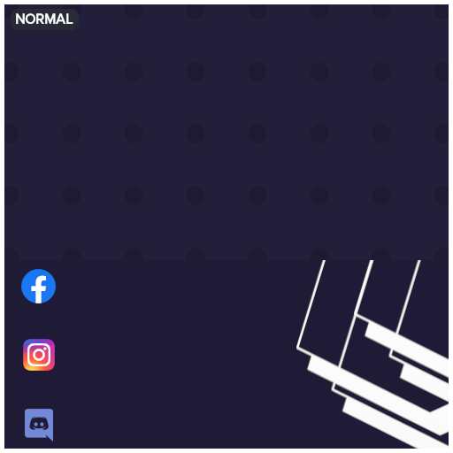

<!-- Project Logo -->

    

    <h3 align="center">Canvas Collections</h3>
    
Create Awesome Image Manipulation using Canvas!

 

<!-- Profile Card -->

    <h3 align="center">Profile Card</h3>

    

<!-- Instagram Card -->

    <h3 align="center">Instagram Card</h3>

    

