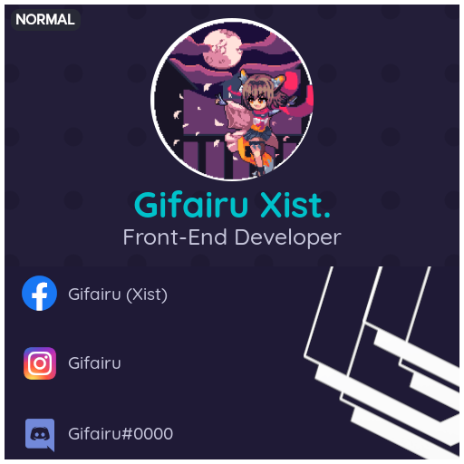

<!-- PROJECT LOGO -->

  

  <h3 align="center">Canvas Collections</h3>
  
Create Awesome Image Manipulation using Canvas!

<!-- PROFILE CARD -->
<h3 align="center">Profile Card</h>

   

<!-- INSTAGRAM CARD -->
<h3 align="center">Instagram Card</h3>

  

